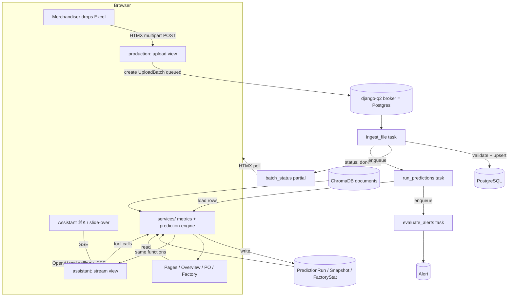
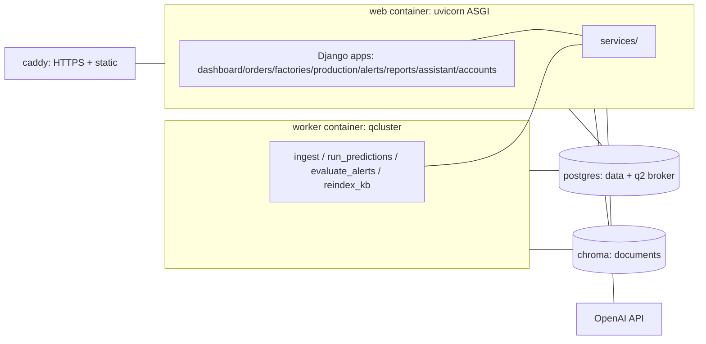

# AI Pulse — Architecture

**Stack (fixed):** Django 5.2 LTS · Python 3.12 · PostgreSQL 16 (psycopg 3) · django-environ ·
Django templates + Tailwind (standalone CLI) + HTMX + Alpine.js + Apache ECharts · django-q2 (Postgres
ORM broker) · OpenAI SDK (tool calling) + `text-embedding-3-small` · ChromaDB (server mode, documents
only) · ASGI via uvicorn (SSE) · WhiteNoise · pandas + openpyxl · pytest-django, factory-boy, ruff.

Server-rendered, no SPA, no React. The design export's React/JSX is a visual reference only.

---

## 1. Project layout

```
karbar_pulse/
  manage.py
  pyproject.toml            # ruff, pytest config
  karbar_pulse/             # project
    settings.py             # django-environ; ASGI; Dhaka TZ; DEMO_TODAY
    asgi.py  urls.py
  apps/
    accounts/               # auth glue, UserProfile, AuditLog, login
    masterdata/             # Department, Season, Factory, FactoryMachine, Holiday, EngineParameter, TATemplate; admin
    orders/                 # Style, PurchaseOrder, POLine(+Size), TAMilestone, Comment
    factories/              # factory list/detail views (reads masterdata + predictions)
    production/             # UploadBatch, DailyProduction, Inspection, Shipment; ingest tasks
    predictions/           # PredictionRun, PredictionSnapshot, FactoryStat; run tasks
    alerts/                 # AlertRule, Alert; evaluation task
    reports/               # shipment forecast, factory performance (+ Later reports)
    assistant/             # Conversation, ChatMessage, TokenUsage; SSE view; tools
    dashboard/             # Executive Overview + app shell
  services/                 # <-- shared business logic (no Django views/templates here)
    calendar.py             # working days, holidays, overtime
    prediction/             # pure-Python engine (engine.py, rates.py, score.py, recommend.py, whatif.py)
    ingest/                 # excel readers + validators + upsert (one module per file kind)
    metrics.py              # portfolio/factory/PO/style aggregates read by views AND assistant tools
    kb/                     # ChromaDB client, chunking, retrieval, citations
    export.py               # table -> xlsx
  templates/
    base.html               # shell: header, sidebar, freshness pill, ⌘K, theme
    components/             # partials (kpi_card, status_badge, source_tooltip, drawer, table, ...)
    dashboard/ orders/ factories/ production/ alerts/ reports/ assistant/ accounts/
    partials/               # HTMX fragments (see §4)
  static/
    src/app.css             # Tailwind input (@tailwind + @layer)
    css/theme-tokens.css    # :root / [data-theme] CSS variables
    vendor/                 # echarts.min.js, htmx.min.js, alpine.min.js (vendored, no CDN)
    dist/app.css            # Tailwind CLI output (collected by WhiteNoise)
  tests/
```

### Why `services/`
Every number has exactly one implementation. Views render; assistant tools answer; **both** import from
`services/`. A view for the Overview and the assistant tool `get_portfolio_kpis` call the *same*
`services.metrics.portfolio_kpis(...)`. This is what guarantees "chat and screens never disagree."

Rules (enforced in review + `test_pure_service`):
- `services/prediction/` imports no Django ORM, views, or settings beyond an injected parameter object.
- Views and tasks contain orchestration only (load → call service → save/render). No formulas in views,
  templates, or assistant tools.

---

## 2. Template structure & HTMX conventions

- **`base.html`** renders the shell once: top bar (brand, freshness pill, ⌘K trigger, theme toggle,
  user), left sidebar (nav with alert badge), and a ``.
- **Components** (`templates/components/`) are included partials: `kpi_card.html`,
  `status_badge.html` (band variants), `source_tooltip.html` (shows `as_of` + source), `po_row.html`,
  `factory_scorecard.html`, `drawer.html`, `table.html`, `empty_state.html`, `stale_banner.html`.
- **HTMX partials** live in `templates/partials/` and are returned by partial views. Naming:
  `partials/<area>/<thing>.html` and the view name `<area>_<thing>_partial`. Each list/table that filters,
  sorts, paginates, or refreshes swaps a single `#<area>-results` target.
  - Examples: `partials/orders/po_table.html`, `partials/orders/whatif_result.html`,
    `partials/production/batch_status.html`, `partials/dashboard/heatmap.html`.
- **Freshness contract:** every page context includes `as_of` and `reports_today {received, expected}`
  from the latest `PredictionRun`; the header pill, KPI tooltips, and chat sources read the same values.
- **Charts:** server embeds an ECharts `option` JSON (from a JSON endpoint or inline `json_script`);
  Alpine initialises the chart; theme changes re-apply colors from CSS variables. Chart kinds: KPI
  sparkline, 8-week stacked bar outlook, stage curves (area band + lines + reference lines), factory
  output lines, on-time trend (line + band), heatmap (ECharts heatmap), T&A Gantt (ECharts custom series).

---

## 3. Static pipeline

- **Tailwind standalone CLI** (no Node build): `tailwindcss -i static/src/app.css -o static/dist/app.css`.
  Run in the Docker image build stage; output committed to the image and served by WhiteNoise.
- **Theme tokens:** `static/css/theme-tokens.css` defines `:root` light and `[data-theme="dark"]` dark
  variables (surface, surface2/3, border, hair, text/2, muted, faint, accent, ai, `status.*`, `stage.*`).
  Tailwind maps them under `colors` so utilities resolve to variables; theme toggle flips `data-theme`
  on `<html>` and persists to `localStorage`.
- **Vendored libraries:** ECharts, HTMX, Alpine are committed under `static/vendor/` and served locally
  (no runtime CDN). `collectstatic` + WhiteNoise with hashed names.
- **Fonts:** IBM Plex Sans + JetBrains Mono (self-hosted woff2 under `static/vendor/fonts/`).

---

## 4. Background jobs (django-q2, Postgres ORM broker)

Tasks (no Redis; `qcluster` process = the `worker` container):
- `ingest_file(upload_batch_id)` — read + validate + upsert one Excel file; update `UploadBatch` status;
  on success enqueue `run_predictions`.
- `run_predictions(trigger, upload_batch_id=None)` — compute `FactoryStat` + score all open POs →
  `PredictionRun` + snapshots; then enqueue `evaluate_alerts`.
- `evaluate_alerts(run_id)` — apply `AlertRule`s to the run → create/update `Alert`s (deduped).
- `reindex_kb(scope)` — (re)chunk + embed documents into ChromaDB.
- **Schedules:** nightly `run_predictions('nightly')`; nightly `pg_dump` (ops, see deployment).

The UI polls `UploadBatch.status` via HTMX (`hx-trigger="load, every 1s"` until terminal).

---

## 5. Flow: upload → ingest → prediction → snapshots → pages/assistant



Key points:
- Pages and the assistant **both** read computed results through `services/`; neither recomputes the
  engine on request.
- The assistant's numeric tools call the exact `services.metrics`/`services.prediction` functions the
  views use. ChromaDB supplies only unstructured text (manual, profiles, notes, comments) for citations.
- Every served number carries the originating run's `as_of`.

---

## 6. Component diagram



See `tech/urls-and-views.md` for every URL/view/partial and `tech/deployment.md` for the compose stack.
